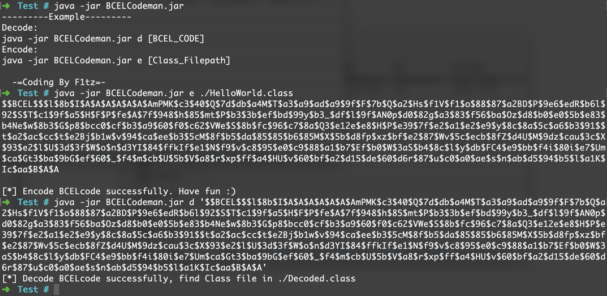
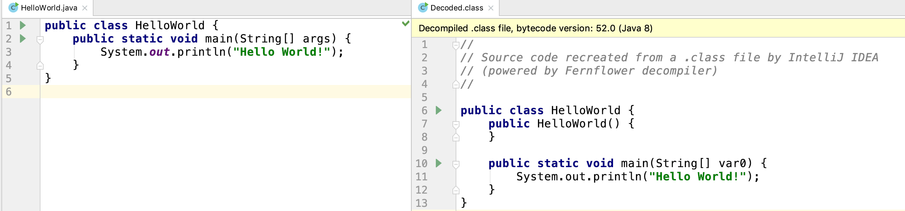

# BCELCodeman

>  初次使用Java编写工具，由于网上找到的编码/解码工具不是很顺手，才制作了这款工具，功能比较单一，就做一件事情BCEL编码/解码。

> 其实工具是在护网期间做攻击溯源的过程中写的，目的是为了分析攻击者使用的fastjson payload。

## How to use

> 主要功能就是将class文件编码为BCEL编码，或将BCEL编码还原为class，从而可以反编译出java源码。

> 使用Decode功能会自动在当前目录下生成**Decoded.class**, 由于BCEL编码存在$符号，请使用***单引号***对代码进行包裹

```shell

Decode:
java -jar BCELCodeman.jar d [BCEL_CODE]
Encode:
java -jar BCELCodeman.jar e [Class_Filepath]

```



解码后的class可以拖入IDEA进行反编译，对比原始java代码效果如下



